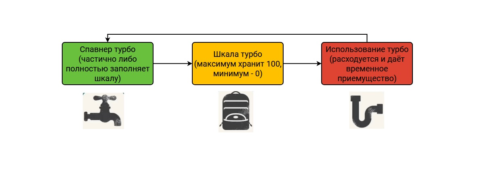
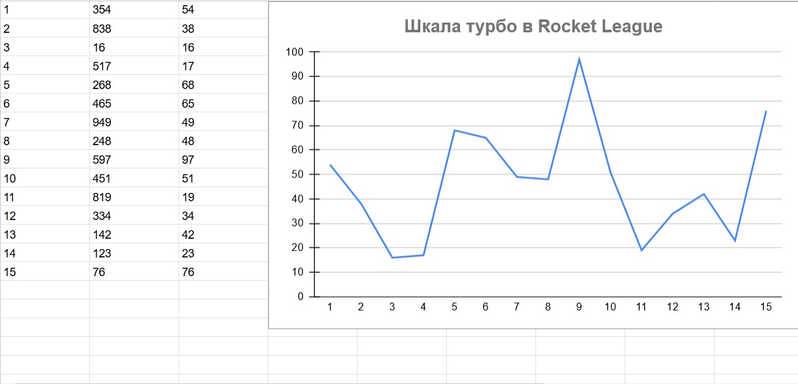

# АНАЛИЗ ДАННЫХ И ИСКУССТВЕННЫЙ ИНТЕЛЛЕКТ [in GameDev]
Отчет по лабораторной работе #2 выполнил(а):
- Алчин Иван Сергеевич
- РИ220945
Отметка о выполнении заданий (заполняется студентом):

| Задание | Выполнение | Баллы |
| ------ | ------ | ------ |
| Задание 1 | * | 60 |
| Задание 2 | * | 20 |
| Задание 3 | * | 20 |

знак "*" - задание выполнено; знак "#" - задание не выполнено;

Работу проверили:
- к.т.н., доцент Денисов Д.В.
- к.э.н., доцент Панов М.А.
- ст. преп., Фадеев В.О.

[](https://nodesource.com/products/nsolid)

[](https://travis-ci.org/joemccann/dillinger)

Структура отчета

- Данные о работе: Нужно больше золота, Алчин Иван Сергеевич, РИ220945, выполненные задания: 1, 2, 3.
- Цель работы.
- Задание 1.
- Код реализации выполнения задания. Визуализация результатов выполнения (если применимо).
- Задание 2.
- Код реализации выполнения задания. Визуализация результатов выполнения (если применимо).
- Задание 3.
- Код реализации выполнения задания. Визуализация результатов выполнения (если применимо).
- Выводы.
- ✨Magic ✨

## Цель работы
Научиться передавать в Unity данные из Google Sheets с помощью Python.

## Задание 1
### Выбрать игровой ресурс, описать его роль, построить схему экономической модели и указать место ресурса в ней 
Ход работы:
- Для данной лабораторной работы я выбрал игру Rocket League®. Rocket League - энергичная игра, сочетающая в себе жанры аркадного футбола и гонок на машинах. Цель игры схожа с целью настоящего футбола, только вместо футболистов управление идёт за машинку. Но главное приемущество игры в том, что у машинки есть турбо, которое позволяет ей быстрее передвигаться и даже летать по карте. Это, в свою очередь, делает игру очень динамичной и позволяет создать красивые голы и сейвы.


- В качестве ресурса я выбрал турбо. Турбо ускоряет передвижение машины, а скорость влияет на силу удара по мячу, также турбо позволяет летать машинке и разрушать машины противников. Турбо накапливается, когда машина проезжает над спавнерами турбо, выделенными оранжевым свечением. Если над спавнером есть оранжевая сфера, то она полностью наполнит шкалу турбо. Турбо расходуется, когда игрок его использует на определённую кнопку. Чем дольше игрок держит кнопку, тем больше турбо расходуется. Максимальное значение шкалы турбо - 100, минимальное - 0. 




## Задание 2
### На языке Python заполните google-таблицу данными, описывающими выбранную игровую переменную.

- Логика заполнения таблицы данными, описывающими шкалу турбо, заключается в том, что значения шкалы всегда лежат в диапазоне от 0 до 100 единиц. Поэтому в коде я делю рандомное значение на 100 и беру остаток, а если значение турбо делится на 100 нацело и больше либо равно 100 (т.е. 100, 200, 300 и т.д.), то таким числам я присваиваю значение 100. Получается следующий код.

```py

import gspread
import numpy as np
gc = gspread.service_account(filename='da-in-unity-3a1eb3e80485.json')
sh = gc.open("DA_In_Gamedev")
turbo_value = np.random.randint(0, 1000, 15)
values = list(range(1,15))
i = 0
while i <= len(values):
    i += 1
    if i == 0:
        continue
    else:
        turbo_scale = turbo_value[i-1] % 100
        if (turbo_scale == 0 and turbo_value[i-1] >= 100): turbo_scale = 100
        trubo_scale = str(turbo_scale)
        
        sh.sheet1.update(('A' + str(i)), str(i))
        sh.sheet1.update(('B' + str(i)), str(turbo_value[i-1]))
        sh.sheet1.update(('C' + str(i)), str(turbo_scale))
        print(turbo_scale)

```

- В таблице эти значения выглядят так.


  

## Задание 3
### Настройте на сцене Unity воспроизведение звуковых файлов, описывающих динамику изменения выбранной переменной.

- Данное задание выполнено в сцене Unity, приложенной [в репозитории](/Unity/Lab2) 

## Выводы

В ходе данной работы я научился заполнять таблицу Google Sheet в коде с помощью языка Python и получать данные из таблицы в скрипте Unity с помощью библиотеки SimpleJSON.

| Plugin | README |
| ------ | ------ |
| Dropbox | [plugins/dropbox/README.md][PlDb] |
| GitHub | [plugins/github/README.md][PlGh] |
| Google Drive | [plugins/googledrive/README.md][PlGd] |
| OneDrive | [plugins/onedrive/README.md][PlOd] |
| Medium | [plugins/medium/README.md][PlMe] |
| Google Analytics | [plugins/googleanalytics/README.md][PlGa] |

## Powered by

**BigDigital Team: Denisov | Fadeev | Panov**
