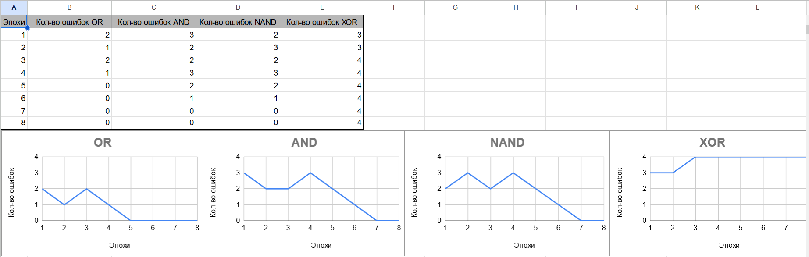

# АНАЛИЗ ДАННЫХ И ИСКУССТВЕННЫЙ ИНТЕЛЛЕКТ [in GameDev]
Отчет по лабораторной работе #4 выполнил(а):
- Алчин Иван Сергеевич
- РИ220945
Отметка о выполнении заданий (заполняется студентом):

| Задание | Выполнение | Баллы |
| ------ | ------ | ------ |
| Задание 1 | * | 60 |
| Задание 2 | * | 20 |
| Задание 3 | * | 20 |

знак "*" - задание выполнено; знак "#" - задание не выполнено;

Работу проверили:
- к.т.н., доцент Денисов Д.В.
- к.э.н., доцент Панов М.А.
- ст. преп., Фадеев В.О.

Структура отчета

- Данные о работе: Перцептрон, Алчин Иван Сергеевич, РИ-220945, выполненные задания: 1, 2, 3.
- Цель работы.
- Задание 1.
- Код реализации выполнения задания. Визуализация результатов выполнения (если применимо).
- Задание 2.
- Код реализации выполнения задания. Визуализация результатов выполнения (если применимо).
- Задание 3.
- Код реализации выполнения задания. Визуализация результатов выполнения (если применимо).
- Выводы.
- ✨Magic ✨

## Цель работы
Создать и визуализировать перцептрон на Юнити.

## Задание 1
### Реализовать перцептрон, вычисляющий OR, AND, NAND, XOR. 
Ход работы:
- Для реализации перцептрона, вычисляющего несколько данных, я переписал исходный код перцептрона. Добавил новый класс TrainingModule (модуль), который отвечают за конкретную функцию. В старте я запускаю корутину, которая ждёт, пока пользователь не нажмёт кнопку. Иначе данные о всех модулях в консоли будут появляться сразу, что неудобно. В цикле я пробегаюсь по каждому тесту, проверяю совпадают полученные данные ли с ожидаемыми и в конце вывожу комментарий по работе всего модуля.
- Реализации перцептрона можно увидеть в проекте, который доступен [в репозитории](https://github.com/W1RDy/Lab4).

## Задание 2
### Построить графики зависимости количества эпох от ошибки обучения. Указать от чего зависит необходимое количество эпох обучения.

- На основании данных, которые у меня получились я построил таблицу. У меня получились данные об ошибках в зависимости от эпохи обучения для каждой функции. Эту таблицу я представил в следующих графиках.
  

- Из графиков видно, что количество эпох обучения зависит от того, насколько сложна задача. Например, нелинейную задачу XOR перцептрон не смог решить за 8 эпох. Количество эпох зависит и от того, насколько сильно изменяются веса. Также можно заметить, что перед тем как количество ошибок начнёт стремительно уменьшатся, перцептрон делает одну дополнительную ошибку, видимо для того, чтобы точно отсеять неправильные варианты.  

## Задание 3
### Построить визуальную модель работы перцептрона на сцене Unity.

- В Юнити я создал 4 куба, которые являются ответами перцептрона на тесты модулей. Слева направо идут тесты с 1 по 4. Если перцептрон отвечает 0, то куб становится красным и уменьшается, а если 1, то - зелёным, увеличивается и подкидывается вверх. Для того, чтобы проверить следующий модуль, нужно нажать на любую кнопку. Данные о модулях и тестах отображаются в консоли.
- Посмотреть данное задание можно в проекте, который доступен в [в репозитории](https://github.com/W1RDy/Lab4). 

## Выводы

В ходе данной работы, я научился обучать перцептрон, создавать для перцептрона разные потоки данных и визуализировать его работу на кубах, используя Юнити. 

| Plugin | README |
| ------ | ------ |
| Dropbox | [plugins/dropbox/README.md][PlDb] |
| GitHub | [plugins/github/README.md][PlGh] |
| Google Drive | [plugins/googledrive/README.md][PlGd] |
| OneDrive | [plugins/onedrive/README.md][PlOd] |
| Medium | [plugins/medium/README.md][PlMe] |
| Google Analytics | [plugins/googleanalytics/README.md][PlGa] |

## Powered by

**BigDigital Team: Denisov | Fadeev | Panov**
