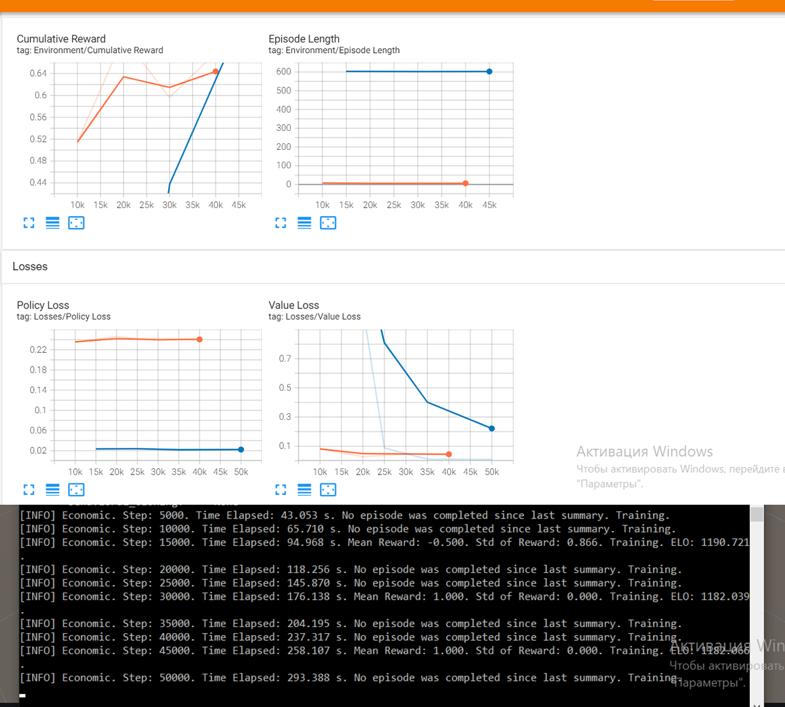
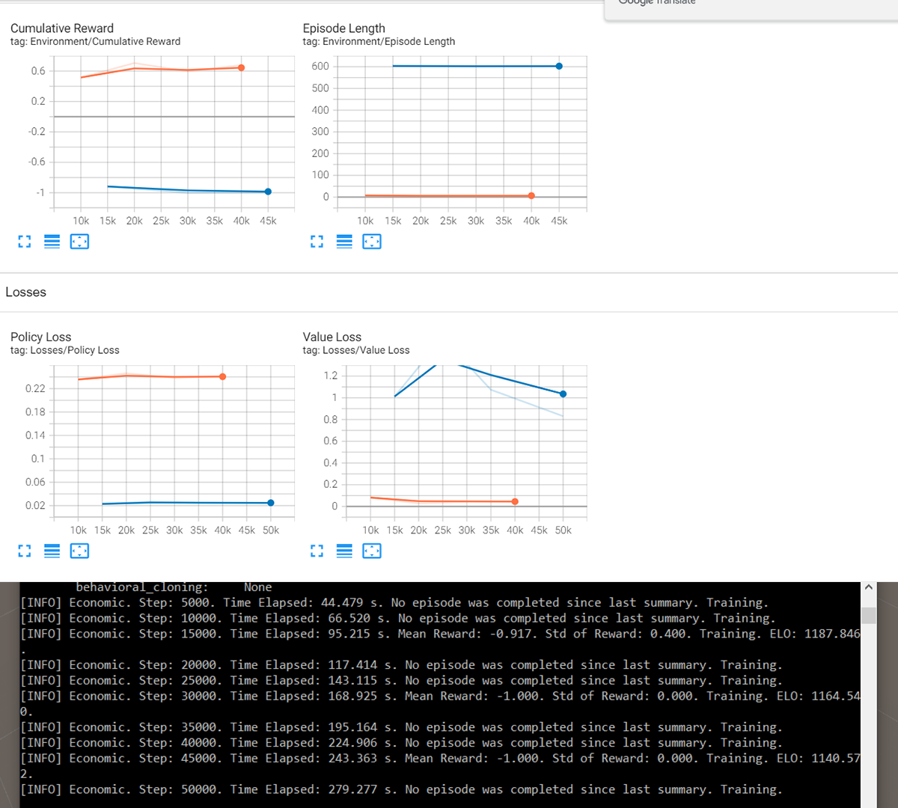
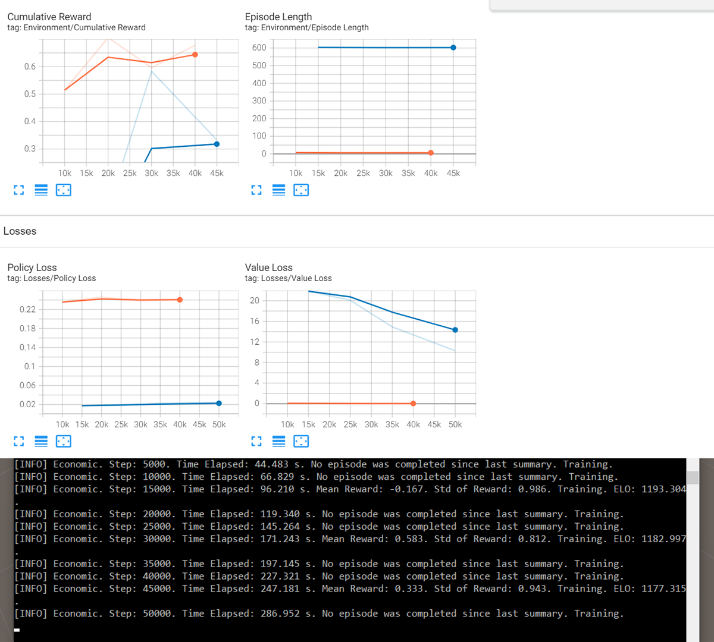

# АНАЛИЗ ДАННЫХ И ИСКУССТВЕННЫЙ ИНТЕЛЛЕКТ [in GameDev]
Отчет по лабораторной работе #5 выполнил(а):
- Алчин Иван Сергеевич
- РИ220945
Отметка о выполнении заданий (заполняется студентом):

| Задание | Выполнение | Баллы |
| ------ | ------ | ------ |
| Задание 1 | * | 60 |
| Задание 2 | * | 20 |
| Задание 3 | * | 20 |

знак "*" - задание выполнено; знак "#" - задание не выполнено;

Работу проверили:
- к.т.н., доцент Денисов Д.В.
- к.э.н., доцент Панов М.А.
- ст. преп., Фадеев В.О.

Структура отчета

- Данные о работе: Машинное обучение в Unity. ML-Agent, Алчин Иван Сергеевич, РИ-220945, выполненные задания: 1, 2, 3.
- Цель работы.
- Задание 1.
- Код реализации выполнения задания. Визуализация результатов выполнения (если применимо).
- Задание 2.
- Код реализации выполнения задания. Визуализация результатов выполнения (если применимо).
- Задание 3.
- Код реализации выполнения задания. Визуализация результатов выполнения (если применимо).
- Выводы.
- ✨Magic ✨

## Цель работы
Познакомиться с программными средствами для создания системы машинного обучения и ее интеграции в Unity.

## Задание 1
### Найдите внутри C# скрипта “коэффициент корреляции ” и сделать выводы о том, как он влияет на обучение модели. 
Ход работы:
- Коэффициент корреляции - это коэффициент взаимосвязи двух переменных, который принимает значения от -1 до 1. Внутри скрипта "Move.cs" не задано явного коэффициента корреляции, но коэффициент корреляции зависит от двух переменных, поэтому меняя диапазон переменных я менял сам коэффициент корреляции.
- Для изменения коэффициента корреляции я выбрал поля amountGold и speedMove и изменял диапазоны их значений сначала на 5-14, а потом на 1-6 и получил такие результаты обучения:

### С изначальными значениями  
 

### С диапазонами 5-14
 

### С диапазонами 1-6

- Таким образом коэффициент корреляции оказывает сильное влияние на обучение модели. Высокий коэффициент корреляции заставляет модель сильнее учитывать взаимосвязи между переменными, что может привести к неправильному обучению. Низкий коэффициент корреляции может отбросить слабо зависимые переменные в угоду оптимизации, но отбрасывание переменных приводит к замедлению обучения модели. Поэтому важно находить золотую серидину коэффициента корреляции.

## Задание 2
### Изменить параметры файла yaml-агента и определить какие параметры и как влияют на обучение модели. Привести описание не менее трех параметров.

- yaml файл предназначен для настройки обучения MlAgent. Он хранит в себе параметры, которые и влияют на само обучение. Изначально у меня была такая статистика обучения:

### С изначальными значениями  
 

- Первым параметром я решил изменить batch-size с 1024 на 256 и получил такие результаты:

### Batch-size на 256  
 

- Из статистики видно, что модель уже спустя 10000 шагов дала верный результат и дальше только закрепляла результат. Но само время, требуемое для прохождения 5000 шагов, в среднем стало больше. То есть параметр batch-size влияет на точность и скорость обучения модели.
- Дальше я рассмотрел параметр lambd и изменил его значение с 0.95 на 0.5 и получил такие результаты:

### lambd на 0.5  

- Модель начала обучаться гораздо медленнее, 50000 шагов заняло почти на 30 секунд больше. Но сама модель обучалась точнее. Все награды, которые она получала были в диапазоне 0.8 - 1. То есть параметр lambd является компромиссом между точностью и скоростью обучения модели.
- Далее я рассмотрел параметр strenght и изменил его значение с 1.0 на 3.0 и получил такие результаты:

### strenght на 3.0  

- Из самого последнего графика видно, что значение ошибок увеличилось до 6 - 12. Это означает, что параметр strenght влияет на чувствительность модели к ошибкам. И установка слишком большого значения данного параметра может привести к неправильному обучению модели. 

## Задание 3
### Приведите примеры, для каких игровых задачи и ситуаций могут использоваться примеры 1 и 2 с ML-Agent’ом. В каких случаях проще использовать ML-агент, а не писать программную реализацию решения? 

- Пример 1 может использоваться для создания NPC, когда нужно реализовать поворот к определённому объекту с учётом нескольких дополнительных параметров. Например, бессмысленно писать MlAgent для поворота объекта к цели в мобильной казуалке, а вот если нужно реализовать поворот врага во время обнаружения игрока в стелс миссии AAA игры, где нужно учитывать множество параметров для поворота, то тут MlAgent упростит реализацию этой задачи.
- Пример 2 может использоваться для анализа и изменения экономики в игре, что помогает искусственному интеллекту подбирать лучшие решения для стабилизирования экономики.
- MlAgent проще использовать, когда нужно реализовать какую-то реалистичную механику, например, поворот врага от уровня шума произведенный игроком или для поиска пути к игроку с обходом препятствий. Для того чтобы реализовать такую механику кодом нужно учитывать множество параметров и проще обучить MlAgent, который будет сам подбирать нужные значения. То же самое касается и изменения экономики и баланса в игре. Нужно проанализировать большое количество данных, чтобы стабилизировать экономику и баланс, поэтому проще обучить для этого MlAgent.

## Выводы

В ходе данной работы, я научился обучать MlAgent в Юнити, а также узнал как влияет коэффициент корреляции на обучение MlAgent, и познакомился с некоторыми параметрами yaml файла, предназначенными для настройки процесса обучения.

| Plugin | README |
| ------ | ------ |
| Dropbox | [plugins/dropbox/README.md][PlDb] |
| GitHub | [plugins/github/README.md][PlGh] |
| Google Drive | [plugins/googledrive/README.md][PlGd] |
| OneDrive | [plugins/onedrive/README.md][PlOd] |
| Medium | [plugins/medium/README.md][PlMe] |
| Google Analytics | [plugins/googleanalytics/README.md][PlGa] |

## Powered by

**BigDigital Team: Denisov | Fadeev | Panov**
